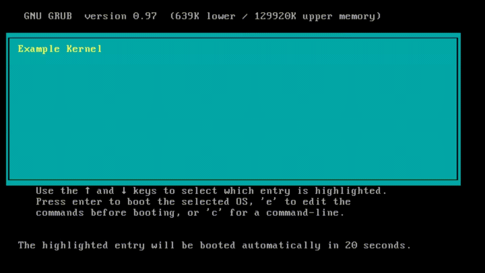

# NoOS

[](https://github.com/nthnn/n2cmu/blob/main/LICENSE)

NoOS (No Operating System) is an attempt unikernel framework for developing bare-metal level Intel i386 programs in pure C++.

> [!WARNING]  
> This project is still underdevelopment and is still at its infancy.

|  |  |
|----------------------------------------|--------------------------------------------|
| Greetings Demo                         | Hello World Demo                           |

## Getting Started

In Ubuntu, you can simply build examples using [Qrepo](https://github.com/nthnn/Qrepo) package manager. On Windows, however, you'll need to have BusyBox and GCC toolchain available on path.

First, you need to clone the NoOS repository to your system:

```bash
git clone https://github.com/nthnn/NoOS
cd NoOS
```

You can now build from examples by:

```bash
qrepo run build <example name>
```

For instance, you can build the Hello World example by: `qrepo run build hello_world` If nothing went wrong, you can proceed to emulate the output ISO file of the compiled example by:

```bash
qrepo run cd <example name>

# qrepo run boot hello_world
```

## Contributing

Contributions to NoOS are highly encouraged and appreciated! To contribute new features, bug fixes, or enhancements, please adhere to the following guidelines:

1. Fork the NoOS repository.
2. Create a new branch for your changes: `git checkout -b feature-name`.
3. Implement your changes and commit them: `git commit -m "Added new feature"`.
4. Push your changes to the branch: `git push origin feature-name`.
5. Submit a pull request for review and inclusion.

## License

Copyright (c) 2024 Nathanne Isip

NoOS is distributed under the GNU General Public License v3.0. For further details, refer to the [LICENSE](LICENSE) file.

```
This program is free software: you can redistribute it and/or modify  
it under the terms of the GNU General Public License as published by  
the Free Software Foundation, version 3.

This program is distributed in the hope that it will be useful, but 
WITHOUT ANY WARRANTY; without even the implied warranty of 
MERCHANTABILITY or FITNESS FOR A PARTICULAR PURPOSE. See the GNU 
General Public License for more details.

You should have received a copy of the GNU General Public License 
along with this program. If not, see <http://www.gnu.org/licenses/>.
```